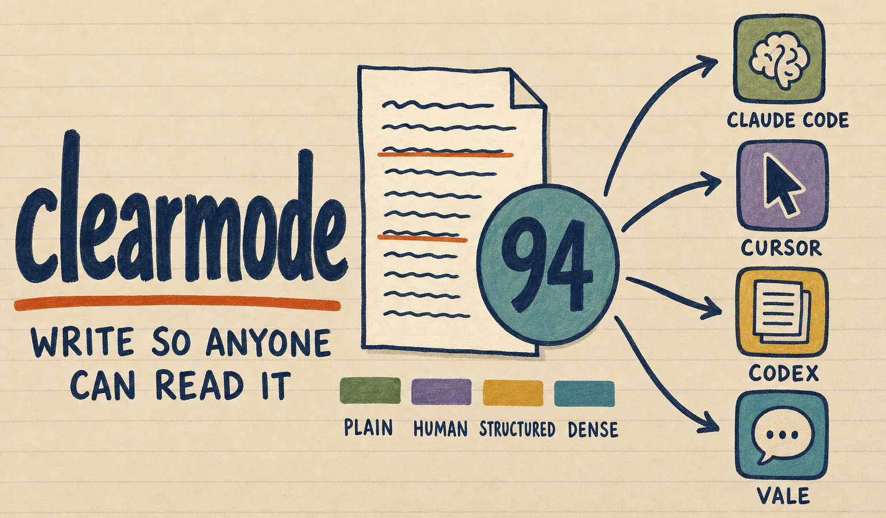
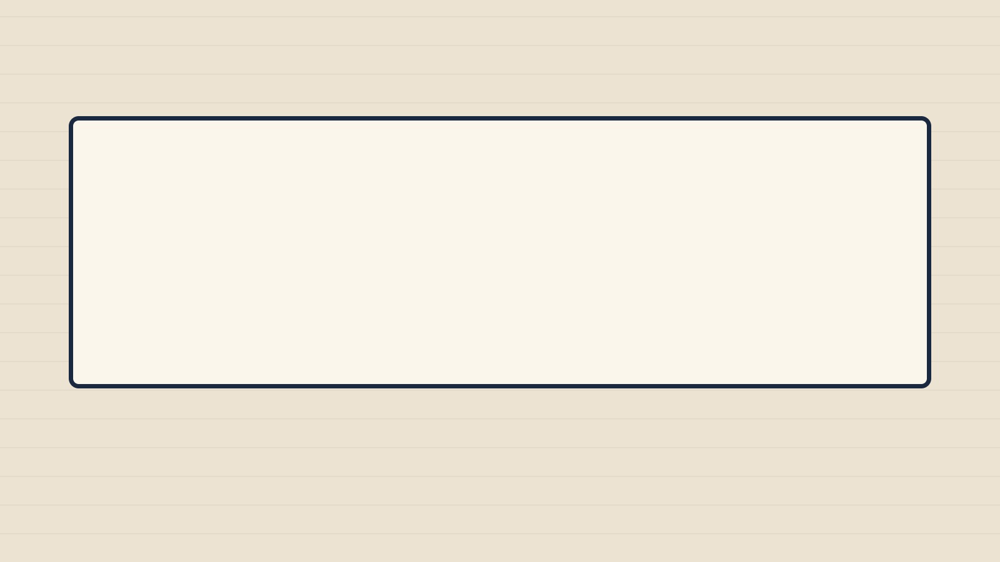

<p align="center">
  <a href="https://github.com/eugeniughelbur/clearmode">
    
  </a>
</p>

<p align="center">
  <a href="#claude-code"></a>
  <a href="#codex-cli"></a>
  <a href="#cursor"></a>
  <a href="#grok-chatgpt-any-chat"></a>
  <a href="#vale"></a>
</p>

<p align="center">
  <strong>Ban the words and you have fixed a third of the problem.</strong>
  <br />
  <em>clearmode checks the other two thirds: can an outsider follow it, and does it say anything.</em>
</p>

<p align="center">
  
  
  
  
</p>

<h1 align="center">clearmode: an anti-AI-slop writing standard and plain-language checker for Claude Code, Cursor, Codex and Vale</h1>

<p align="center">
  <strong>CLEAR-100 scores any text 0 to 100 against 43 rules, then names the line that loses the reader.</strong>
  <br /><br />
  <em>Four axes, one number. <strong>Plain</strong>: can an outsider read it once and get it. <strong>Human</strong>: does it read like a person who did the work. <strong>Structured</strong>: does the page shape match the information shape. <strong>Dense</strong>: does every sentence carry something unguessable.</em>
  <br /><br />
  <strong>One rule pack, 18 targets.</strong>
  <br />
  <em>Claude Code skill. <code>AGENTS.md</code> block. Cursor rule. Vale style. System prompt.</em>
  <br />
  <em>All generated from <a href="rules/clear-100.json">one JSON file</a>, so they never drift apart.</em>
  <br /><br />
  <strong>Zero install.</strong> <em>Python 3.10 and the standard library. No pip, no npm, no API key, no network call, no telemetry.</em>
  <br /><br />
  <a href="#quickstart"><strong>Quickstart &rarr;</strong></a> &middot;
  <a href="#install-into-your-agent">Install</a> &middot;
  <a href="#the-four-axes">The axes</a> &middot;
  <a href="CLEAR-100.md">All 43 rules</a> &middot;
  <a href="#how-it-compares">Compare</a> &middot;
  <a href="#faq">FAQ</a>
</p>

<p align="center">
  
  <br />
  <em>Real session, real output. Every finding names the rule, the file and the line, and says what to write instead.</em>
  <br /><br />
  <em>If this looks useful, <a href="https://github.com/eugeniughelbur/clearmode">star the repo</a>. It is how other people find it.</em>
</p>

---

## The problem

Aerospace solved ambiguity in 1986. [ASD-STE100](https://www.asd-ste100.org/) gave maintenance manuals 53 rules and about 900 approved words, because a mechanic under a wing cannot ask the author a follow-up question. It works. It also bans contractions, so it reads like a machine, on purpose.

Two things changed since. Models draft the text now, so the failure mode moved from ambiguity to filler that scans as competent. And the reader sits outside the field, on a phone, deciding in one screen.

clearmode keeps that discipline and adds the 3 axes STE never needed.

## The four axes

| Axis | What it asks | Weight |
|---|---|---|
| Plain | Can someone outside the field read it once and get it? | 30% |
| Human | Does it read like a person who did the work? | 30% |
| Structured | Does the shape of the page match the shape of the information? | 25% |
| Dense | Does every sentence carry something a reader could not guess? | 15% |

## Quickstart

```bash
git clone https://github.com/eugeniughelbur/clearmode.git
cd clearmode
python3 scripts/clearcheck.py tests/fixtures/bad.md
```

No pip, no npm, no config. Python 3.10 and the standard library.

Real output on the two fixtures in this repo:

```text
tests/fixtures/bad.md   CLEAR 41.4/100  band F  this reads like a model wrote it
  Plain 41.5  Human 0  Struc 90.0  Dense 43.0
  24 error, 23 warn, 6 review

tests/fixtures/good.md  CLEAR 98.0/100  band A  ready to publish
  Plain 97.0  Human 100.0  Struc 100.0  Dense 92.5
  0 error, 1 warn, 1 review
```

## Install into your agent

All 18 files below compile from `rules/clear-100.json`, so they never drift apart.

Fastest path: `./install.sh` detects what you have and writes only between markers, so running it twice changes nothing.

```bash
./install.sh --dry-run   # show what it would touch
./install.sh             # do it
./install.sh --hook      # and govern Claude's replies to you, not just your files
```

Or install one surface by hand.

### Claude Code

clearmode is a Claude Code skill. Copy the skill and its references, then restart Claude Code.

```bash
mkdir -p ~/.claude/skills/clearmode
cp -r SKILL.md references rules scripts ~/.claude/skills/clearmode/
```

Four slash commands come with it: `/clear-check`, `/clear-rewrite`, `/clear-init`, `/clear-explain`.

### The reply hook

Everything above governs files. This governs what Claude says to you.

```bash
./install.sh --hook
```

It scores each finished reply and makes Claude rewrite it before the turn ends. You never see a score. You just stop reading jargon.

19 of the 43 rules interrupt a reply. The rest stay advisory, because a chat turn is a different contract from a document, and a judgement-call rule that fires on good writing is worse than no rule. The list is `BLOCK_ON` at the top of `hooks/check_reply.py`, one line per rule, edit it to taste.

It edits `~/.claude/settings.json` and backs it up first. Restart Claude Code after. To switch it off:

```bash
python3 scripts/register_hook.py --remove
```

### Codex CLI

Codex reads `AGENTS.md` from the repo root.

```bash
cp targets/codex/AGENTS.md ./AGENTS.md
```

### AGENTS.md (Cursor, Copilot, Gemini CLI, Aider, Windsurf, Zed)

`AGENTS.md` is the cross-tool standard most agents now read. Paste the block into an existing file instead of overwriting it.

```bash
cat targets/agents-md-snippet.md >> AGENTS.md
```

### Cursor

Cursor also supports native project rules in `.mdc` format.

```bash
mkdir -p .cursor/rules && cp targets/cursor/clearmode.mdc .cursor/rules/
```

### Grok, ChatGPT, any chat

Paste `targets/grok/custom-instructions.txt` into the custom instructions box. For an API call, use `targets/system-prompt.txt` as the system prompt.

### Vale

clearmode ships a Vale style package, so a prose linter you already run in CI can enforce the same rules.

```bash
cp -r targets/vale/ClearMode /path/to/your/styles/
```

`targets/vale/.vale.ini` shows the config.

## The rule pack is the source of truth

`rules/clear-100.json` holds every rule, threshold, and word list. The checker reads it. Every target above is generated from it.

```bash
python3 scripts/compile_targets.py          # rebuild all 18 targets
python3 scripts/compile_targets.py --check  # fail if any target is stale
```

Disagree with a rule? Change the JSON and recompile. Nobody hand-edits a target.

## Profiles

One standard, four reader models.

| Setting | general | technical | social | agent |
|---|---|---|---|---|
| Sentence cap | 25 | 28 | 20 | 20 |
| Sentences per paragraph | 4 | 5 | 2 | 6 |
| Reading grade target | 9 | 11 | 8 | 9 |

```bash
python3 scripts/clearcheck.py post.md --profile social
```

## Gate it in CI

```bash
python3 scripts/clearcheck.py docs/*.md --gate 80        # exits 1 below 80
python3 scripts/clearcheck.py README.md --json           # machine-readable
python3 scripts/clearcheck.py post.md --strict           # any finding fails
```

A ready workflow sits in `.github/workflows/clear.yml`.

## Slash commands

| Command | What it does |
|---|---|
| `/clear-check` | Score and report. Changes nothing. |
| `/clear-rewrite` | Rewrite in five ordered passes until it clears the gate. |
| `/clear-init` | Wire the standard into this repo's agent files and CI. |
| `/clear-explain` | Explain one rule, or defend it. |

## How it compares

Feature comparison against the tools people reach for first. Checked 2026-08-28.

| | clearmode | [anti-ai-slop-writing](https://github.com/jalaalrd/anti-ai-slop-writing) | [the-antislop](https://github.com/aplaceforallmystuff/the-antislop) | [ASD-STE100 skills](https://github.com/danyuchn/asd-ste100-skill) | [Vale](https://github.com/vale-cli/vale) |
|---|---|---|---|---|---|
| Bans slop vocabulary | yes | yes, 130+ patterns | yes, 35+ in 3 tiers | no | only if you write the rules |
| Glosses jargon for outsiders | yes, 79 terms | no | no | no | no |
| Checks page structure | yes | partly | no | partly | no |
| Measures information density | yes | no | no | no | no |
| Keeps contractions | yes | yes | yes | no, bans them | n/a |
| Numeric score | yes, 0-100 on 4 axes | no | yes, risk tiers | no | no |
| Deterministic checker | yes, stdlib only | prompt-only | prompt-only | some | yes, needs a style pack |
| Reading grade per audience | yes, 4 profiles | no | no | one audience | configurable |
| One source compiled to every tool | yes, 18 targets | no, one SKILL.md | no | no | n/a |
| Install size | zero deps | zero deps | zero deps | zero deps | binary |

Short version. The word-list tools fix vocabulary. Vale gives you an engine and no opinion. STE fixes ambiguity for a mechanic, not readability for an outsider. clearmode is the only one that scores all four at once and ships the same rules to every agent you use.

## FAQ

### What is AI slop?
Low-quality AI-generated text. The [2026 arXiv paper](https://arxiv.org/abs/2509.19163) that first defined it found readers judge slop through latent dimensions like coherence and relevance, not through a word list alone. That is why clearmode scores density and structure, not just vocabulary.

### How do I check if my text sounds AI-generated?
Run `python3 scripts/clearcheck.py yourfile.md`. Anything under 70 reads like a model wrote it. The report names the exact line and rule.

### Is this an AI detector?
No. It measures readability, not authorship. A human can write a 41. A model can write a 95.

### Does it work with ChatGPT, Cursor, Codex, or Grok?
Yes. `targets/` holds a prebuilt file for each. Copy one file, or run `./install.sh`.

### How is this different from an anti-slop word list?
A word list catches `delve` and stops. clearmode also asks whether a non-specialist can follow the sentence, whether the page has a shape, and whether the sentence says anything the reader could not guess.

### Why not just use ASD-STE100?
[Simplified Technical English](https://www.asd-ste100.org/) solved ambiguity for aerospace manuals in 1986 and still works. It also bans contractions and reads robotic, has no concept of AI slop, and assumes a trained technician as the reader.

### What reading grade should I aim for?
Grade 9 or lower for a general audience, 11 for technical docs, 8 for social. The profiles set this for you.

### Can I turn a rule off?
Yes. Edit `rules/clear-100.json`, then run `python3 scripts/compile_targets.py`. Never hand-edit a generated target.

### Does it run offline?
Yes. Python 3.10 and the standard library. No API key, no network call, no telemetry.

## What it will not do

- It cannot tell you a claim is true. Wrong and clear is still wrong.
- It will not strip a technical term that is the subject. It glosses it once.
- It is not a compliance claim against ASD-STE100. That dictionary is ASD's copyright and is not reproduced here.
- It is not an AI detector. It measures readability, not authorship.

## Prior art

- [ASD-STE100 Simplified Technical English](https://www.asd-ste100.org/), the 53 rules and the one-meaning-per-word discipline
- [Wikipedia: Signs of AI writing](https://en.wikipedia.org/wiki/Wikipedia:Signs_of_AI_writing), the deepest catalogue of tells anyone maintains
- [Measuring AI Slop in Text](https://arxiv.org/abs/2509.19163), Shaib et al., which found readers react to information density more than to any word list
- [plainlanguage.gov](https://digital.gov/guides/plain-language) and [GOV.UK content design](https://www.gov.uk/guidance/content-design), for the plain-word tables and the evidence that high-literacy readers prefer plain English too
- [Vale](https://github.com/vale-cli/vale), whose style format `targets/vale/` speaks

## More from the author

*The standard is above. This is the rest of the workbench.*

<p align="center">
  <a href="https://github.com/eugeniughelbur/obsidian-second-brain"><strong>obsidian-second-brain</strong></a><br />
  <em>Persistent memory for Claude Code and 6 other CLI agents, stored as plain markdown in your Obsidian vault. 45 commands.</em><br />
  
</p>

<p align="center">
  <a href="https://github.com/eugeniughelbur/doceo"><strong>doceo</strong></a><br />
  <em>A personal AI tutor as a skill. Turns any topic, file, folder or URL into a one-screen visual lesson.</em><br />
  
</p>

<p align="center">
  <strong>From the blog</strong> &middot; <a href="https://theaioperator.io">The AI Operator &rarr;</a><br />
  <em>One post per Tuesday on AI agents, second-brain systems, and bringing AI into real work.</em>
</p>

<div align="center">

<table>
<tr>
<td align="center" width="700">

### Follow along

*What actually works when you put AI writing in front of real readers.*

<a href="https://x.com/eugeniu_ghelbur"></a>
<a href="https://www.linkedin.com/in/eugeniu-ghelbur/"></a>
<a href="https://theaioperator.io"></a>
<a href="https://github.com/eugeniughelbur"></a>

</td>
</tr>
</table>

</div>

---

## Citing this

If you write about clearmode or use it in research, [CITATION.cff](CITATION.cff) has the metadata. GitHub renders a ready citation from the sidebar.

## Contributing

Rules are arguments. If a rule is wrong, open an issue with a sentence it flags that should pass, or a sentence it misses that should fail. That is the most useful bug report this repo can get.

Change `rules/clear-100.json`, run `python3 scripts/compile_targets.py`, run the tests, open a pull request. Never hand-edit a file under `targets/`.

```bash
python3 -m unittest discover tests -v
python3 scripts/compile_targets.py --check
```

## License


MIT. See [LICENSE](LICENSE).
